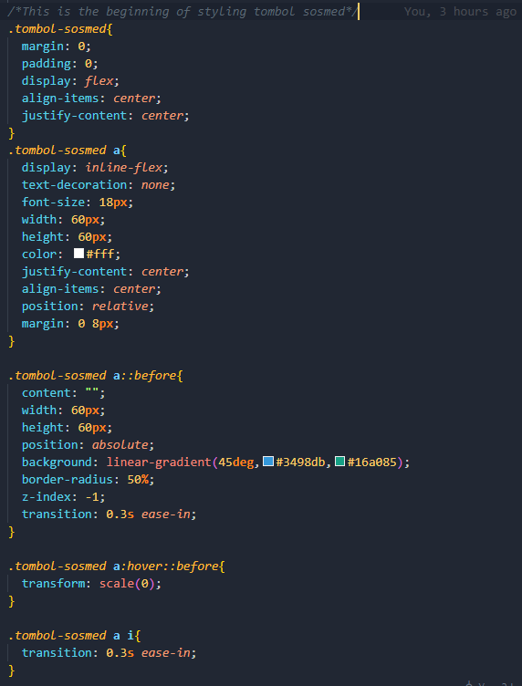
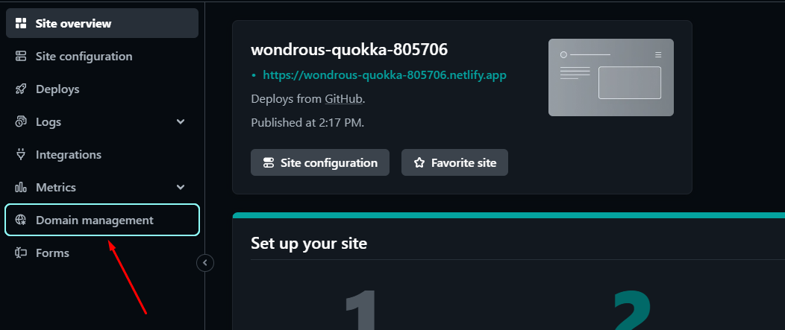
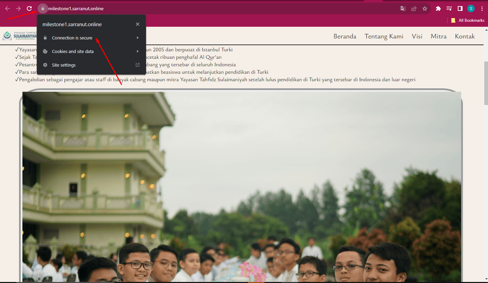

# Documentation 

**_This is assignment for Milestone Project 1 on Revou FSSE Section Seoul._**

*Theme Name :* Yayasan Tahfidz Sulaimaniyah Website (Company Profile Website)

*Author :* Sarra Nutrisia

*Created :* 17/11/2023 

*HTML Version :* HTML 5

*CSS Version :* CSS 3

***
As a web developer, the three main languages we use to build websites are HTML, CSS, and JavaScript. We use HTML to structure the site, CSS to design and layout the web page, and JavaScript to create dynamically updating content. For this week, I have build a simple website about company profile of Yayasan Tahfidz Sulaimaniyah using HTML, CSS and JavaScript.
***
## Table of Contents 
1. HTML Structure
2. CSS File
3. JavaScript File
4. Readme File
5. Images File

***
## 1. HTML Structure 
The HTML Structure for each page is as follows:
* Meta
* Link to CSS Files
* Link to JavaScript File
* Header
	* Beranda
	* Tentang Kami
	* Visi
	* Mitra
	* Kontak
* Content
	* Tentang Kami
	* Visi dan Misi
	* Mitra Yayasan Sulaimaniyah
	* Video
	* Form
* Footer
    * Kontak 
	* Copyright
  
You can check the Deployment of this website by clicking this link : [Link Netlify](https://wondrous-quokka-805706.netlify.app/) 
  
***
## 2. CSS File 
There are two CSS file in this theme:
* stle.css
* responsive.css

##### indexstyle.css
This CSS file is the main stylesheet for the theme. It holds all the values for the different elements of theme and the default color scheme.

##### responsive.css
This CSS file contain responsive web design provides an optimal experience, easy reading and easy navigation with a minimum of resizing on different devices such as tablet and desktop.

***
## 3. JavaScript File 
There is one JavaScript file in this theme:
* index.js

##### index.js
This theme use the alert function and dom function of JavaScript.

***
# Building A Simple Project Website 
There are few steps to Building A Simple Project Website, there are Determine The Dependencies, How To Set Up The Project, Deployment Flow, Buy A Domain, Connect Domain to Netlify.

***
## Determine The Dependencies 

1. HTML 
2. CSS 
3. JavaScript
4. Internal & External Source
   * images
   * icons
   * fonts
  

***
## How To Set Up The Project 

1. First thing first, make sure you had log in to canvas and click the submission link to create repository in github classroom.

2. Then you are automatically connected to your repository in github classroom. Don't forget to clone the repository from github into your local storage. If you had clone that repository, then start to create your website in order to submit the assigntment to github classroom. This are steps you could follow until pushing your project into github classroom.

3. After push your project into github classroom, don't forget to change the visibility in your repository from "Private" into "Public" before deploy your project on Netlify, as follows.

4. After this you can deploy the project to Netlify. If there is any revision on your project, you can submit again the revision into repository by following step 2 and 3 without clone the repository.

5. I want to share on how i got the icons, fonts, and images to running this project. You can click this link below to use it too.

   * Go to [Flaticon Website](https://www.flaticon.com/icons) 

   * Go to [Google Fonts Website](https://fonts.google.com/icons) 

   * Go to [Yayasan Tahfidz Sulaimaniyah Website](https://www.tahfidzsulaimaniyah.org/) 

6. Some of images can also slowing your website's performance because the size are too large. You can compress the images into smaller size with tiny png belows.

   * Go to [Tiny PNG Website](https://tinypng.com/) 

7. In order to get the right colouring theme, I used to search it from flatuicolors and adobe color. Here are the links.

    * Go to [Flatuicolors Website](https://flatuicolors.com/) 

    * Go to [Adobe Color Website](https://color.adobe.com/create/color-wheel) 

8. I want to inform how I set up the social media button on my project and how it will be. This design is simple but it looks pretty good only by using HTML and CSS, no need to implement JavaScript also. These below are the codings and the result.

    

    

    

***

## Deployment Flow 
Before sign up to netlify, make sure you have a github account and had push your project to your Github Account. After that, follow this step :
1. Go to [Netlify Website](https://www.netlify.com) 
   
2. Sign Up & Log In to Netlify > Login with GitHub.
   
   

   

3. After the configuration with GithHub, then choose Add New Site > Import an Existing Project.
   
   

4. Connect to git provider > Pick a repository > Choose Site Configuration and Deploy the Site.
   
   

   

   

5. After deploy the site, then the deploy link will appear and it will be automatically refreshed every time you push "project" to your GitHub.
   
   

## Buy A Domain 
Please do a research which domain site do you prefer to purchase based on the price and needs. (I choose domain from Niagahoster because it's cheap and convincing)
1. Go to [Niagahoster Website](https://www.niagahoster.co.id/)           
   
2. Login > Register > Choose "Search New Domain / Cari Domain Baru".
   
   

3. Type your domain name you want > and then click "Search Now / Cari Sekarang" > click "Choose / Pilih".
   
   

4. Follow the instruction for following payment option.
   
   

5. The Domain Site has been purchased and you can use it.
   
   
    

## Connect Domain to Netlify 
The Domain Name System (DNS) turns domain names into IP addresses, which browsers use to load internet pages. Every device connected to the internet has its own IP address, which is used by other devices to locate the device.

1. Go to your Netlify account, choose your deploy site.
   
   

2. Click Menu "Domain Management" to "Add a Domain" and verify your domain from Niagahoster to Netlify's deploy site. Previously, i have used the domain and now i also want to add subdomain from it, as follows.
   
   

   

   
   
   
3. I had set up netlify DNS to domain on previous week. So now, I don't need to set up the DNS again. Just make sure the subdomain link it's working and has security on it. Then your subdomain address ready to use. Before that, please follow this step belows.
   
    

   

   

     

You can check domain of this project by clicking this link : [Domain Niagahoster](https://milestone1.sarranut.online/) 

***

#### Theme by Sarra Nutrisia &#127776;
If you have any other questions that aren't covered in the documentation, feel free to e-mail &#128233; <sarra.nutrisia@gmail.com>.